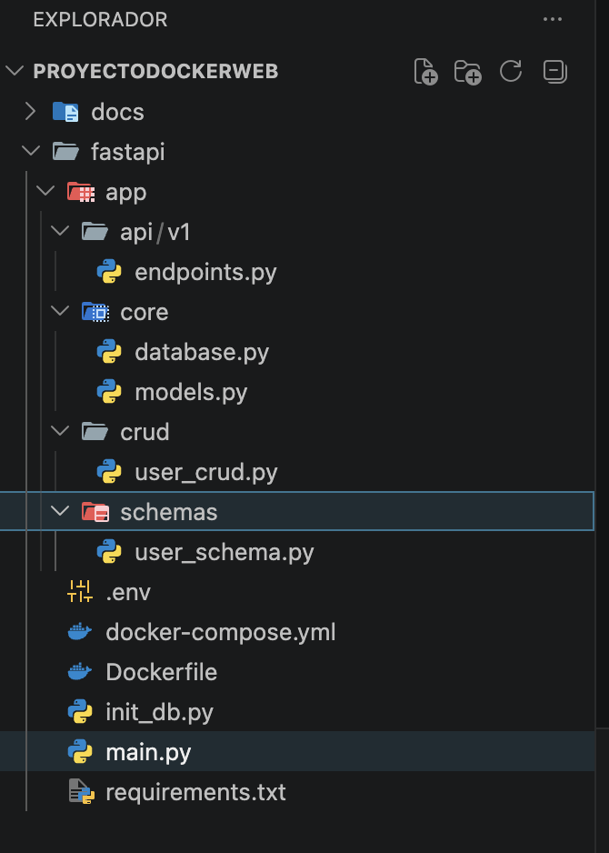
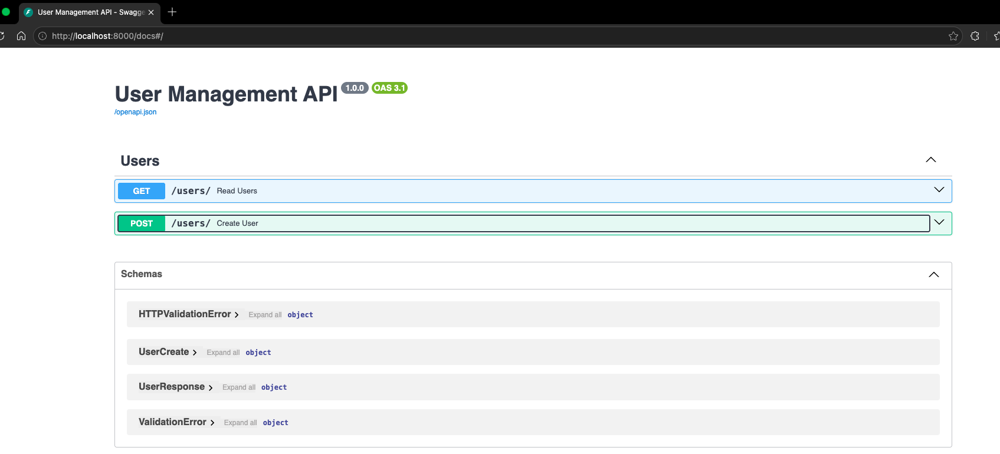
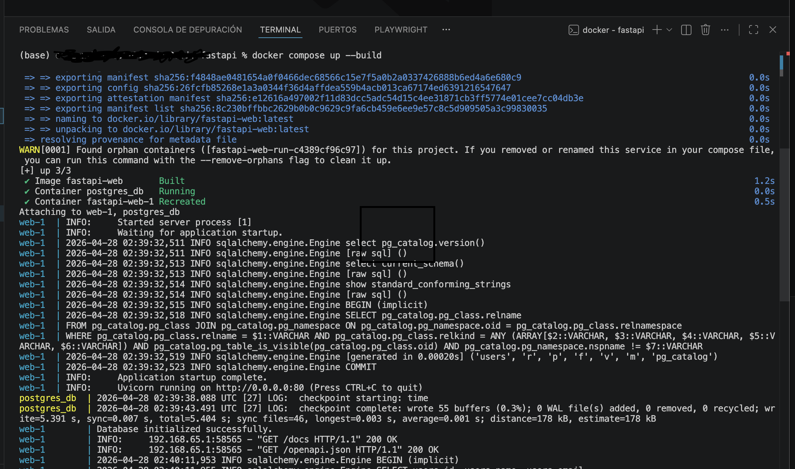
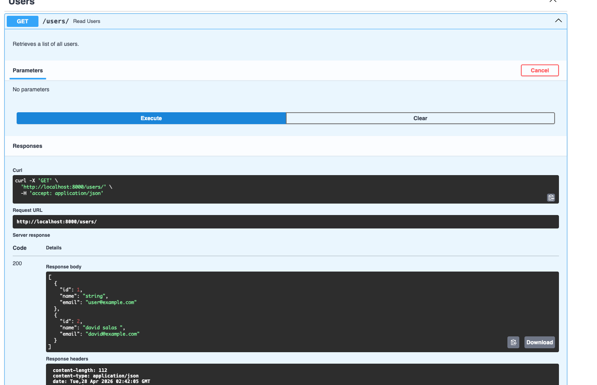
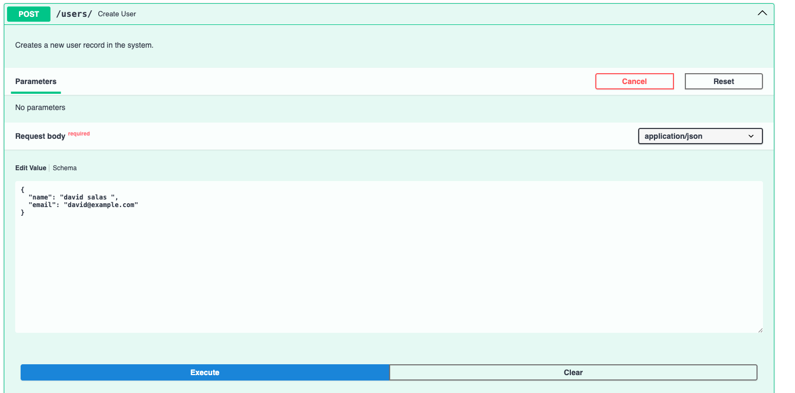
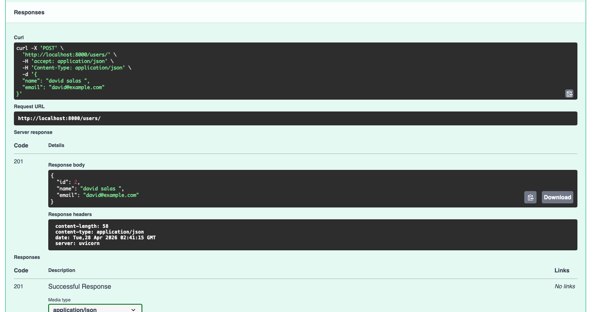

# 🚀 FASTAPI Projecto - Backend con Docker y GitHub Pages

Este proyecto implementa una aplicación **FastAPI** con estructura modular, CRUD de usuarios, integración con Docker y desplegado en un entorno virtual local para poder consumir actualizar y ver la documentacion del API, expuesta.

---
## Enlaces

- **Página Web:** [Sitio web demo](https://12345star.github.io/ocker-postgres-python-fastapi)

---
# 👨‍💻 Autor
David Salas Lorente

📧 Contacto: [Linkeding](https://www.linkedin.com/in/david-salas-lorente-757947198/)

---

## 📂 Estructura del proyecto
- `app/api/v1/endpoints.py` → Endpoints principales.
- `app/core/database.py` → Configuración de base de datos.
- `app/core/models.py` → Modelos ORM.
- `app/crud/user_crud.py` → Operaciones CRUD de usuarios.
- `app/schemas/user_schema.py` → Validación de datos.
- `main.py` → Punto de entrada de la aplicación.
- `docker-compose.yml` y `Dockerfile` → Configuración de contenedores.
- `requirements.txt` → Dependencias del proyecto.

## 🚀 Instalación
```bash
git clone https://github.com/tuusuario/fastapi-project.git
cd fastapi-project
pip install -r requirements.txt
uvicorn app.main:app --reload
```
## 📋 Correr el contenedor
```bash
docker-compose up --build
```

## 🌐 Despliegue en GitHub Pages
Este repositorio está configurado para servir documentación y ejemplos en GitHub Pages.

## 📸 Screenshots
En la carpeta img/ encontrarás imágenes de la estructura del proyecto y ejemplos de ejecución.

## 📈 SEO y Analítica
- Uso de meta tags optimizadas.
- Integración con Google Analytics.
- Documentación clara y estructurada para indexación en buscadores.

## Estructura del proyecto 📂

```plaintext
. FASTAPI
├── main.py                     # El main principal del app
├── README.md                   # Documentación del proyecto
├── LICENSE                     # Licencia del proyecto
├── .gitignore                  # Archivos y carpetas a ignorar por Git
├── img/                        # Carpeta para imágenes a mostrar
│   └── Estructura_Proyecto.png # Imagen de la estructura del proyecto
│   └── Estructura_Swagger.png  # Imagen de la documentacion del api
│   └── Levantar_Contenedor.png # Imagen de cuando se levanta el contenedor
│   └── Get_UsuariosDB.png      # Imagen donde se ven los usuarios de la DB
│   └── insertar_Usuario1.png   # Imagen donde se inserta el usuario parte 1
│   └── insertar_Usuario2.png   # Imagen donde se inserta el usuario parte 2
├── .env                        # Variables para conectarse a la DB
├── init_db.py                  # Permite poder inicializar la DB, y tablas
├── requirements.txt            # Dependencias que se deben instalar
├── Dockerfile                  # Encargado crear y cargar la imagen de docker
├── docker-composer.yml         # API FastAPI con PostgreSQL en Docker
├── app/.                       # Carpeta principal para el proceso del API
│   └──api/.                   
│   |   └──v1/.                 # Carpeta de las versiones del API 
│   |      └──endpoints.py      # versionamientos del API 
│   └── core/.               
│   |     └── database.py       # Inializa la base de datos con el modelo
│   |     └── models.py         # modelos de las tablas
|   └── crud/                        
|   |     └── user_crud.py      # Es donde esta todos lo get, pos, update, dalete 
|   └── schemas/   
          └── user_schema.py    # Son los esquemas  de las clases de las tablas            

```
---
## Vista previa de la aplicación

### A. Estructura del proyecto


### B. Estructura Swagger


### C. Levantar del Contenedor


### D. Optener Usuarios de la base de datos


### E. Inserción de usuario nuevo



